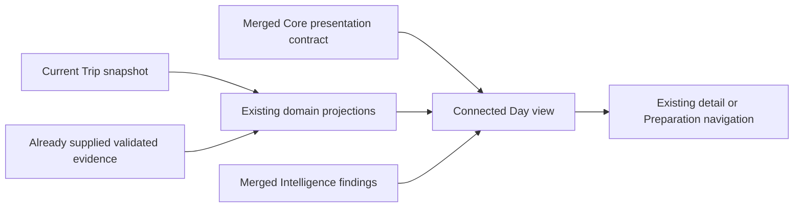

# Connected Day Experience integration design 1

6 October 2026 · Issue #886 · Draft PR #890 · Design only

**CONNECTED_DAY_EXPERIENCE_INTEGRATION_DESIGN_1_READY** means the bounded design is ready for independent review. It is not runtime readiness, Technical-Lead PASS, provider activation or permission to mark the PR Ready.

## 1. Scope, baseline and product decision

Binding [TASK](CONNECTED_DAY_EXPERIENCE_INTEGRATION_DESIGN_1_TASK_2026-10-06.md), immutable blob `29cf9b02d83974cf6aeaa5f3946acfc215e78bb5`. Repository baseline and live main at reconstruction: `fc2734ca60ae3c578fbcd414055fe983773d74d2`; mode `NORMAL`. Task seed: `dab5d00a8021f6690e02977684af67e226501c00`. Branch: `docs/connected-day-experience-integration-design-1`.

The day should answer: what is planned, what needs checking, and where can I resolve it? Its value comes from connecting existing trip truth to a concrete day, reducing repeated interpretation and switching between domains. This follows the [Product Differentiation Doctrine](JETNITY_PRODUCT_DIFFERENTIATION_DOCTRINE_2026-08-30.md), [Logic Standard](LOGIC_STANDARD.md) and [Workspace target](TRIP_WORKSPACE_TARGET_ARCHITECTURE.md). It makes no market-uniqueness claim.

One Trip graph remains authoritative. Connected Day is a read projection plus navigation intent. It owns no itinerary, booking, readiness, route, price or Official Truth store. Recommendations never move, reorder, cancel, book or confirm anything. No runtime, schema, DB/Supabase, live provider/API data, F8, Production action or global continuity edit belongs to this slice.

## 2. Repository evidence and present limits

All paths below were inspected at the exact baseline above. Historical reports explain intent; live code and the newer #751 execution directive decide current availability. In particular, the old domain-tab descriptions in `DESIGN_SYSTEM.md` and the original Workspace target are historical IA; current `workspace-mode.ts` supplies four modes. No global document is changed here.

| Area | Existing contract / evidence | Consequence for this design |
| --- | --- | --- |
| Graph and identity | [types/trips.ts](../types/trips.ts): `Trip`, `TripDay`, `TripStage`, `TripItem`, `revision`, `ohneTag` | References resolve inside the current trip; no duplicate item store. Item clocks are local `HH:MM`, without zone. |
| Timeline | [timeline.ts](../lib/trips/timeline.ts), [day-stage-assignment.ts](../lib/trips/day-stage-assignment.ts), [Plan](../components/trips/TripWorkspacePlan.tsx) | Baseline uses canonical day/stage refs. Future Core ordering is not yet a merged contract. Unassigned days/items must survive. |
| Navigation | [workspace-mode.ts](../lib/trips/workspace-mode.ts), [detail.ts](../lib/trips/detail.ts), [U02/U03 report](TRIP_WORKSPACE_CONTEXTUAL_NAVIGATION_PREPARATION_TARGETING_1_REPORT_2026-10-05.md) | Reuse mode/day/item selection and exact Preparation section/traveller targeting; deleted refs fall back safely. |
| Booking | [buchung.ts](../lib/trips/buchung.ts), `types/trips.ts`, DECISIONS ADR-0089 | `unconfirmed` / `booked`; source only `user`. Manual marking supports flight, stay, transfer, rental car; not activity or note. No cancellation state. |
| Preparation | [domain.ts](../lib/readiness/domain.ts), [workspace-presentation.ts](../lib/readiness/workspace-presentation.ts), [preparation-premium-experience-5.ts](../lib/readiness/preparation-premium-experience-5.ts) | Personal tasks and official evaluations are separate. Section/traveller deep links exist; exact task-row deep links do not. |
| Official bridge | [official.ts](../lib/readiness/official.ts), [trip-official-evaluations-server.ts](../lib/readiness/trip-official-evaluations-server.ts), [B01 report](TRIP_WORKSPACE_B01_OFFICIAL_EVALUATION_WIRING_1_REPORT_2026-10-05.md) | Account evaluates the loaded Trip; provider factory remains null. A passed prop does not mean positive official evidence exists. Guest does not inherit Account authority. |
| Readiness invalidation | [fingerprint.ts](../lib/readiness/fingerprint.ts), [TRAVEL_READINESS](TRAVEL_READINESS.md) | Reuse currentness; ticket/booking fingerprint includes dates/status/place refs, but not `startsAt`/`endsAt`. Do not claim every schedule edit already stales a personal check. |
| Attention | [attention.ts](../lib/trips/attention.ts), [attention-presentation.ts](../lib/trips/attention-presentation.ts), [protected-item tests](../lib/trips/protected-item-date-attention.test.ts) | Keep domain severity, state and identity; `item.date_mismatch` is an existing projection, not a booking cancellation. |
| Place/map | [places/domain.ts](../lib/places/domain.ts), [account/world-map.ts](../lib/account/world-map.ts), [world-map tests](../lib/account/world-map.test.ts) | Stage coordinates can support stage pins. `Ort` has provenance and coordinates; a Place-ID alone is not coordinates. Existing world map is not a street-route engine. |
| Route/mobility | [route/domain.ts](../lib/route/domain.ts), [route/vergleich.ts](../lib/route/vergleich.ts), [mobility/kanten.ts](../lib/mobility/kanten.ts), [MOBILITY](MOBILITY.md) | Flight topology and mobility coverage remain domain-owned. No inferred walking time, airport transfer or itinerary edge from row adjacency. |
| Flight coverage | [flug-abdeckung.ts](../lib/trips/flug-abdeckung.ts), [merged #877 report](TRIP_WORKSPACE_FLIGHT_COVERAGE_PROOF_GUARD_1_REPORT_2026-10-06.md) | Current guard requires directed route proof; the old audit's date-only association defect must not be reintroduced. |
| Price/budget | `TripItem.priceAmount/priceCurrency`, `Trip.budgetAmount/currency`, [detail.ts](../lib/trips/detail.ts), [handelsfelder-nutzlast.ts](../lib/trips/handelsfelder-nutzlast.ts), DECISIONS ADR-0054 | Stored amount is not live availability, payment or a model estimate. Guest→Account strips unproved commercial fields; recompute from the resulting graph. |
| Change preview | [reiseaenderung/diff.ts](../lib/reiseaenderung/diff.ts), [geschuetzt.ts](../lib/reiseaenderung/geschuetzt.ts), DECISIONS ADR-0058/0059 | Existing revision/idempotency and commercial protection remain; text diff is not a complete dependency graph or clock-change detector. |

## 3. Common source, freshness and projection contract

The following are **abstract design requirements**, not exported TypeScript types or promised interfaces from #888/#889.

Every connected observation carries: feature; trip and exact affected refs; source class; evidence reference (or explicit absence); observed/checked time with its meaning; applicable date/time interval and location precision if relevant; validity/freshness; result availability; input snapshot identity; and safe navigation intent. Source classes stay distinct:

- **Stored user truth:** what a user entered or marked. Account storage does not promote it to external verification; Guest storage remains a local draft.
- **Verified external fact:** only a domain's already validated, context-bound evidence. Commercial, venue, weather and regulatory facts retain separate trust boundaries.
- **Derived result:** reproducible from named inputs and rule version; never a new external fact.
- **Estimate:** explicit method, assumptions, amount/unit and scope; never stored as a confirmed price or exact travel time.
- **Advisory suggestion:** optional interpretation, with its supporting evidence; no change authority. Free text remains a user note.

Freshness and availability are independent. `not_evaluated`, `insufficient_context`, `unavailable`, `error`, `stale`, `conflict` and a successful empty result cannot collapse into one green state. These are descriptive cross-feature concepts; existing domain enums remain unchanged. Missing timestamps cannot be manufactured from render time. `Trip.updatedAt` is a snapshot timestamp, not the date a price, venue or booking was verified. `bookingConfirmedAt` is the user's marking time. Official `checkedAt` is the evaluation/check time, not publisher update time.

External adapters would need a versioned freshness policy, retrieval time, source observation/issue time where available, applicable location/time and validity. No universal TTL is invented here. Missing source-specific freshness policy or validity => cannot claim current. Expiry can degrade a result even if the graph is unchanged. Source absence never justifies silent re-fetch or activation.

The read flow is:

There is intentionally no arrow from the view to graph mutation or network retrieval. Navigation revalidates refs at use time. A later editing flow must retain its existing explicit action, ownership, validation, revision and commercial-protection boundaries.

## 4. Booking and confirmation composition

Booking state, personal confirmation task and source confidence are separate axes. Presence in the timeline, a price, provider name, URL, activity timeslot or trip-level `status=booked` cannot book an item.

| Current facts | Compact row | Detail / next action |
| --- | --- | --- |
| Supported kind, `unconfirmed` | `Ausgewählt` | `Buchung in Jetnity nicht bestätigt`; existing manual confirmation action, clearly a user declaration. |
| Supported kind, `booked`, source `user` | `Gebucht · von dir bestätigt` | Show available marking time. No `Vom Anbieter bestätigt`, payment or reservation-validity claim. |
| Linked current personal ticket/booking check is open | At most one secondary hint: `Bestätigung noch prüfen` | Preparation → `tickets-buchungen`. An open task proves an open check, not that no confirmation document exists. |
| Linked check is stale, even if marked done | `Bestätigung erneut prüfen` when this is the highest priority hint | Preserve user's historical done mark in detail; no automatic unbooking. |
| No applicable task/evidence | Booking label only; detail `Bestätigungsnachweis nicht erfasst` | Do not assert a missing document merely because the data model has none. |
| Activity or note | `Geplant` where useful | Existing runtime has no supported booking mark for these kinds. Reservation remains unknown or explicitly a user note. |
| Invalid source/status combination | `Buchungsstand prüfen` | Fail closed, keep stored item visible; do not fabricate a valid booking. |

**Cancellation boundary:** there is no canonical `cancelled` state. Text such as “storniert” stays labelled as a user note and cannot mutate status, remove cost or claim provider cancellation. Existing `Buchung korrigieren` can explicitly return supported items to `unconfirmed`; that is not a verified cancellation or refund. A future structured cancellation contract is separately required before automated cancellation banners, refundable amounts or cancellation-dependent costs.

## 5. Preparation / Readiness bridge and exact navigation

Only day-relevant signals appear inline: a personal task with an exact `tripItemId`; an existing dated/item Attention finding; or an OfficialEvaluation whose canonical traveller/credential/destination/transit scope can be bound to this day's exact stage/route occurrence. Same country, label or date alone is insufficient when occurrences repeat. Current OfficialEvaluation does not carry a stage-occurrence ref; ambiguity stays trip-level in Preparation. An undated custom task has no invented deadline or day membership.

Reuse `readinessWorkspaceSichtbar` and canonical Official presentation. Do not resurrect the hidden coarse entry/visa/document/insurance user cards beside Official rows. User done/skipped never resolves an official requirement. Only truly empty Official placeholders can collapse under existing rules; evidence-bearing, stale, conflicting and different credential rows remain available individually.

Deduplicate repeated presentation of the **same** source finding, not similar text. Personal identity is the trip + exact task `clientRef` and target; Official identity retains traveller, credential option, destination, transit, requirement, visa semantics, evidence/context and navigation target. Distinct evidence or conflict remains visible. Grouping may fold peers under one disclosure but retains every member and uses exact section/traveller intent, as the existing Attention grouping does. No “first passport”, first evaluation or label-based identity.

Use existing domain severity (`blockierend`, `bald`, `hinweis`) without turning all unknowns into emergencies. Prioritize required action and stale checks; severity is not evidence confidence. Count each source finding once per day summary, even if linked from multiple rows. Trip-wide unknowns belong once at summary/Preparation level, not on every item.

**Exact existing target contract:** `PreparationZiel = { bereich, travellerClientRef? }`, through `queryFuerModus` / `modusUrl` and `modusFuerReise` on the current trip path. Values are encoded by the existing URL builder, never concatenated from raw input.

| Signal | Existing query target on the current trip URL |
| --- | --- |
| Missing traveller/document context | `ansicht=vorbereitung&vorbereitung=reisende-dokumente`, plus `reisender=<exact applicable clientRef>` only when known |
| Official requirement / stale / unavailable | `ansicht=vorbereitung&vorbereitung=offizielle-anforderungen`, same optional traveller ref |
| Ticket / booking personal check | `ansicht=vorbereitung&vorbereitung=tickets-buchungen`, optional exact traveller ref if the target exists |
| Custom preparation | `ansicht=vorbereitung&vorbereitung=eigene-vorbereitung`, optional exact traveller ref if applicable |

No new query keys, fragments or fabricated task anchors. Existing navigation opens the section and focuses the applicable traveller heading, otherwise its section summary. It does **not** promise to focus one requirement/task row. A later exact-row extension needs its own reconciled contract. Deleted traveller => section; deleted item/day => valid parent. Return to the originating day/item through existing internal history; direct links use a safe parent, never an arbitrary external return URL. Navigation starts no check, search or write.

## 6. Day map and presentation route

Minimum pin proof is an existing same-trip ref bound to stored finite latitude/longitude in valid ranges (−90..90, −180..180), with known representation: stage/city/region versus exact venue. Zero is valid; missing is not zero. Preserve the source ref, original precision and available provenance. A `placeId` without a supplied matching `Ort` record and coordinates cannot place a pin. No geocoding from title, address text, note, country or airport code.

The current graph has stage coordinates but no general activity/stay venue coordinate contract. A stage pin is labelled `Etappenort`, never silently copied to each activity, hotel or restaurant. A city/region centroid is context, not a meeting point. Flight route points have IATA/country/city but no coordinates in their current type. Transfers' stored Place-IDs may resolve only through an already available exact canonical record; missing records remain in the text list. No hidden lookup is assumed.

Use the **merged Core's** ordered row references for numbered day stops; that order is presentation only. Do not persist it to stage position, TripItem position, route itinerary, mobility edges or country/transit facts. Flexible/no-time items retain their group and have no invented place in a timed route. Unlocated rows remain visible between located stops; do not draw a continuous line that hides the gap. Two overlapping markers may share a hit area but expose all item refs; same label is not identity.

Without a routing provider, show a location list and optionally stored-coordinate pins with `Reihenfolge im Tagesplan`. Any later schematic straight connection must say it is schematic, with no navigation/travel-time/feasibility claim. Do not borrow `durationMinutes` from mobility's local-clock arithmetic as a routing ETA across zones. Actual walking/driving/transit directions, travel times, street tiles and closures require separate approved sources and contracts. The existing world-map renderer supplies neither street detail nor route feasibility.

## 7. Weather: scoped advisory context

Future weather requires a source identity and safe source reference; retrieved/check time; forecast issue time; forecast valid interval; exact matched location/coverage and precision; units; timezone/offset where clock comparison is needed; and source-specific expiry. Location/time must intersect the intended activity occurrence, not merely the trip country. Out-of-horizon dates, missing zone for a precise comparison, conflicting forecasts or failed location binding remain unknown.

`outdoor` relevance must be an explicit structured user/activity fact. Current `TripItem` has no such field; titles (“Museum”, “Walk”), interests and an LLM cannot supply it. Without that fact, weather may be general day context only, with no activity-specific “move indoors” instruction. Seasonal patterns remain seasonal; they are not live weather. Official weather alerts, if ever supported, must use their separately governed Safety boundary rather than being minted by this advisory layer.

Current/fresh information may say `Wetterhinweis für diesen Ort und Zeitraum`; detail exposes source, issued/checked times and interval. Stale values retain their timestamp and `Veraltet – erneut prüfen`, without current recommendation. No source or provider => `Wetter nicht verfügbar` in requested details, no permanent empty warning on every row. No comparison with activity time without valid time semantics; no universal “today” from the device timezone. Weather never moves or cancels an activity. An optional suggestion can only open details; any editing is a separate explicit user workflow.

## 8. Opening hours, reservation windows and user notes

Three independent records are needed conceptually; none is added to runtime here:

| Record | Required evidence | Allowed statement |
| --- | --- | --- |
| Verified venue hours | Exact venue/branch identity, first-party venue or qualified licensed feed, source reference, checked time, validity/schedule version, venue zone, relevant date and exceptions/holiday coverage | `Laut Quelle geöffnet …` only for the proven interval; no assertion about admission, tickets or availability. |
| Reservation window | Exact item/venue/date and local interval; source class user versus independently verified reservation; confirmation provenance if present | `Von dir angegebene Reservierungszeit …` or separately proven confirmation. A chosen activity timeslot is not a reservation. |
| User note | Existing item note and item ref | `Deine Notiz`; never automatically parsed into hours, reservation or verified closure. |

Confidence is explained through source class, matching scope and completeness, not an invented percentage. Broker/search snippets, model text or popularity data are discovery-only and never hard hours truth. A source URL alone is not verification. Opening-hours feeds must cover the actual branch and exceptional date; ordinary weekly hours do not prove a holiday is open. Overnight windows and DST ambiguity require explicit venue-local semantics.

Fresh hours that exclude the exact planned interval may create an advisory `Öffnungszeit prüfen`. A stale closure is `Öffnungszeiten veraltet – Termin prüfen`, never `Geschlossen` as a current fact. A valid reservation does not override a closure fact; expose the conflict and both sources. Missing end time permits only the proven start comparison, not a claim the whole visit fits. Missing hours, venue identity, expiry policy or timezone => unknown. No cancellation, rebooking or itinerary movement follows automatically.

## 9. Daily cost and future True Trip Cost

The first provider-free view is **saved prices for points assigned to this day**, not total daily expenditure. Use each unique item ref once from the current graph. A valid stored amount and currency travel together; missing price is missing, never zero. Zero may be displayed only when explicitly stored and valid. Invalid/negative/non-finite amounts, currency-only and amount-only records are excluded with an incomplete indicator. Never parse numbers from notes or travel wishes.

Show same-currency subtotals with their basis (`Gespeicherte Preise`, item count and missing count). Optionally divide rows into selected and user-marked-booked; these groups describe booking state, not paid amounts or provider-confirmed price. Existing provider/ref/URL fields alone do not prove price verification. Detail states `Gespeicherter Preis; aktuelle Verfügbarkeit nicht geprüft`, and available provenance. Unknown price age remains unknown; do not call the snapshot a fresh quote.

**Attribution:** an item's full saved amount is attributed once to its valid canonical `dayId`, even when it has a multi-day stay/rental interval. Label it as the full saved item price associated with that day, not a nightly charge. Do not divide by nights, multiply by travellers, repeat on every visible stay occurrence or allocate by a timeline anchor. Stage-only/`ohneTag` items remain under `Noch keinem Tag zugeordnet`; keep them visible in trip context and outside daily sums. This bounded accounting basis must be disclosed before showing a subtotal.

If Core presents an item on several days, only the canonical assignment contributes money. If stored `startsOn` disagrees with day date, show the assignment basis and existing mismatch hint; do not silently move either cost or event. Missing/ambiguous IDs make the sum incomplete. Cancellation notes do not subtract a price; refunds and cancellation fees need separate facts.

Example, synthetic arithmetic only: saved prices CHF 80 + CHF 20 and EUR 30 => `CHF 100 · EUR 30`, never one combined amount. An additional unpriced item produces `1 Preis fehlt`. `Trip.currency` is a preference, not an exchange rate. Budget is a trip-level target, not a cost; no automatic daily budget, “under budget” or complete-trip-total claim.

Estimates stay in a separate block with method/source, scope, assumptions and currency; never overwrite `priceAmount` or join the stored-price subtotal. There is no current estimate contract, so this block stays absent until a separate bounded contract exists. Future True Trip Cost may consume source item refs, original money, allocation basis, completeness and estimate separation. It must define fees, tax, party basis, multi-day allocation, refunds and any explicit timestamped FX before claiming a comparable full trip cost. This document creates no ledger, estimate producer or FX service.

## 10. Change Impact: dependency and invalidation contract

Change Impact explains **which existing points need review and why**. It does not assert that a flight was changed by an airline: without new external evidence, `Flug geändert` means the saved Trip flight changed. Planned preview says `Wenn du diesen Flug änderst …`; only a committed change supports past tense. No old snapshot means no reconstructed historical change claim.

A proposed in-memory dependency record has source ref, dependent ref, relation kind, consumed field set, proof/basis and input identity. It is derived/rebuilt, never stored as a second graph. Relation membership must be proven; same day/name alone is only possible relevance.

| Source change | Proven dependency / existing foundation | Safe result and gap |
| --- | --- | --- |
| Flight route/date/local schedule | Exact route `sourceItemIds`; linked ticket task `tripItemId`; required-section proof from current flight coverage | Re-evaluate route/coverage and linked check. A time-only edit invalidates day results even if the existing route/readiness fingerprint stays equal. |
| Flight → transfer | Exact structured directed endpoint identities and an explicit/reconciled occurrence association | Review the transfer timing/location. Current graph has no general flight-to-transfer ref; ambiguous matches cannot become confirmed edges. |
| Flight → stay | Existing exact stage/day assignment may prove shared scope; a specific arrival/check-in dependence requires unique occurrence/time evidence | `Ankunft/Unterkunft prüfen` as a scoped review candidate; no inferred check-in policy, cancellation or guaranteed conflict. |
| Transfer → activity | Explicit/reconciled dependency on the transfer arrival, exact location/occurrence/time | Review feasibility only with sufficient evidence. Timeline adjacency alone proves neither travel dependence nor required buffer. |
| Stay → activity/transfer | Shared exact stage/item location facts actually consumed by a derived view | Invalidate location-bound route/hours/weather context, not every same-country activity. No hotel centroid copied to venue. |
| Traveller/document/destination change → readiness | Existing credential/scope projection and canonical context fingerprints | Re-run existing domain derivations, preserve unknown/unavailable; never turn recheck into a new official ruling. |
| Item date/day/stage/price/status change → summaries | Same item ref contributes to map, assigned-day cost, booking or readiness view | Drop old result and rebuild from current graph; do not duplicate cost or keep a deleted pin. |

**Count semantics:** `3 Punkte betroffen` counts three unique dependent actionable targets, not edges, reasons, repeated cards or the changed source. Targets may be plan items or preparation tasks, with their type disclosed in detail. Multiple reasons for one target remain one point. A day summary is not another target. Uncertain links are reported separately as `Weitere Auswirkungen noch unklar`; no precise “3” from speculation. `0 nachgewiesene Folgepunkte; Prüfung unvollständig` is not `Keine Auswirkungen`.

**Worked example (future acceptance fixture, not a current graph capability):** user-marked-booked flight F changes its stored arrival date (`endsOn`). A reconciled explicit arrival relation binds transfer T; an exact stay occurrence/check-in relation binds stay S; applicable personal ticket task R has `tripItemId=F` and a previously matching fingerprint. Result: `Flug geändert – 3 Punkte betroffen`, detail T `Anschluss prüfen`, S `Ankunft/Unterkunft prüfen`, R `Bestätigung erneut prüfen`. The day cost/map refresh is not counted again. T/S schedules, booking marks and R's stored user status remain unchanged; Readiness may derive R as stale. If the T/S links are unavailable today, show the one proven linked task plus unknown possible effects; do not display the three-point example as implemented.

**Invalidation protocol, required before any future runtime:**

1. Capture one current trip identity/revision and the exact input snapshot, plus domain evidence identities, freshness boundary and presentation/rule versions. This is ephemeral derivation identity, not a bearer proof or new persistence field.
2. Every accepted graph replacement/edit invalidates the whole Connected Day result first. Do not rely only on `Trip.revision`: reconcile relevant input signatures/events for local edits, direct manual changes and separately supplied evaluations. User note, clock-only and price edits may not change existing domain fingerprints.
3. Rebuild against the new snapshot; resolve every ref again. Discard results arriving for an older snapshot/request generation, wrong trip, old evidence, expired interval or superseded day selection. No stale success flash while refreshing.
4. Existing domains own whether a personal check becomes `stale` or `not_applicable`; the day layer may say its own assessment needs rechecking but cannot rewrite their status. Recompute domain truth through existing boundaries.
5. Deleted/moved items lose old links and pins, summaries recompute, and open detail navigates to the valid parent. Unknown old/new comparison remains unknown; do not resurrect removed state from cache or Guest history.
6. A later explicit edit proposal must be revalidated against the latest revision by its existing mutation path. This view never cascades writes, even after acknowledging a warning. No background rebooking, automatic “fix all” or bypass of commercial protection.

## 11. Feature evidence / fallback / provider matrix

“Provider: no” means this presentation can reuse already loaded Jetnity data in a separately authorized implementation. It does not authorize any new call in this slice.

| Feature | Source class | Freshness | Provenance | Failure / unknown state | UI fallback | New provider dependency |
| --- | --- | --- | --- | --- | --- | --- |
| Booking | Stored user fact; later verified booking separately | Current graph; user marking time only | Exact item + booking source/time; no fabricated document | Missing/invalid state; unsupported kind; cancellation unknown | Planned/selected or `Buchungsstand prüfen`, existing detail | **No** for stored state; **yes** for future independent external verification |
| Preparation / Readiness | Personal user task; canonical OfficialEvaluation; derived Attention | Domain currentness/fingerprint; Official freshness unchanged | Task ref or full evaluation scope/evidence, exact target | Not evaluated, partial, stale, unavailable, ambiguous day | One scoped hint + correct Preparation section; trip-level if unbound | **No** to project supplied results; fresh external Official Truth remains separately gated |
| Day pins | Stored stage/Place fact, derived projection | Current snapshot; coordinate source age may be unknown | Exact ref + coordinate origin/precision, never label-only | Missing/invalid coordinates, unresolved place, deleted ref | Accessible unlocated list, stage pin only where proven | **No** for local schematic/stored coordinates; **yes** for new geocoding/street tiles |
| Day route | Derived presentation order; optional verified route result later | Core snapshot; later route result validity and travel mode | Ordered row refs + location proofs; route source/version if supplied | Gaps, flexible order, no route/ETA evidence | Numbered location list; `Wegezeit nicht geprüft` | **No** for order/list; **yes** for actual route/time feed |
| Weather | Validated external forecast + advisory interpretation | Issue/check time + interval + expiry policy, not render time | Source + location precision + time/zone + units | Stale, no source, out of horizon, offline, relevance unknown | On-demand `Wetter nicht verfügbar` or dated stale context | **Yes** for live weather; none active |
| Venue hours | Verified external venue fact | Checked time + date/exception validity + expiry policy | Exact venue/branch, source/version, zone, coverage | Stale closure, holiday unknown, source conflict/outage | `Öffnungszeiten prüfen`, source details; no current closed/open claim | **Yes** for fresh verified hours unless already supplied by an approved domain |
| Reservation / note | Explicit user fact versus verified reservation; free note separate | User observation time if known; external confirmation validity separately | Exact item/venue/time and source; note never promoted | No structured reservation contract, stale/ambiguous confirmation | `Deine Notiz` / `Reservierung nicht bestätigt` only when applicable | **No** for notes/stored user facts; **yes** for external verification |
| Daily saved costs / estimates | Stored price, derived per-currency subtotal; estimate separate | Current snapshot; price observation age unknown unless proved | Unique item refs, original currency, assignment basis, missing count | Partial, mixed currency, invalid amount, unassigned, unknown allocation | Original-currency subtotals labelled incomplete; separate unassigned list | **No** for stored subtotal; future live prices/FX need separate provider contract |
| Change Impact | Derived dependency review, never source of schedule truth | Exact before/after snapshots, rule version, evidence freshness | Changed ref + each dependency proof/reason and completeness | Missing before, ambiguous relation, stale result, race | `Auswirkungen noch unklar` / rebuild; details with proven subset | **No** for proven graph relations; external disruption/ETA requires later source |

## 12. Progressive disclosure and cross-device contract

One row contains time/flexible label, title, compact place if proven, booking text where relevant, and **at most one secondary actionable hint**. No per-feature icon rail. Highest relevant domain severity wins the inline hint; all other findings remain in one `Details` action and the day summary. Essential status/source qualification must not be hidden behind hover. Missing optional weather/map/hours data does not create three warnings per item.

Day summary: date/day label, planned count, one prioritized review sentence, saved-price subtotal with basis, and optional `Orte ansehen`. At most three expanded priority groups, consistent with existing Attention disclosure; additional groups under `Weitere Hinweise`. Counts reflect unique findings, not every rendering. Do not combine personal preparation completion with an official clearance score. “No urgent finding” may be used only with the domain's complete evaluated state; never `Alles bereit` from missing evaluations.

Details: full affected items and reasons, source/freshness/location/time, missing information, original-currency breakdown and one contextual action. Use the current item-detail and four-mode shell; day-only disclosures need no new route. Item detail uses existing `ansicht=plan&tag=<day>&punkt=<item>` navigation. A future day drawer must reconcile with that history contract rather than adding speculative URL parameters.

| Width | Required interaction and density |
| --- | --- |
| **360** | One column, wrapping titles/status, 44px primary touch targets, no page overflow. Map collapsed behind `Orte ansehen`; default day view remains timeline-first. Full-width details, visible labelled Back, no swipe-only action. |
| **390** | Same hierarchy and controls; no extra mandatory widgets. Primary action reachable one-handed; safe-area spacing and sticky elements cannot cover last row or focused control. |
| **768** | Same single selection state; optional side-by-side summary if it fits. Map still opt-in, never above all day content by default. Expanded details remain reachable with keyboard and touch. |
| **1440** | Professional timeline/detail split; one selected day/item shared by both panes. Optional map in detail area; never a second itinerary, auto-selected item or separate filter truth. |

Expanded mobile map should use a bounded panel (design target no more than roughly one-third of the viewport height in the day view), with a same-content text list and explicit close control; an intentionally opened larger view may fill the screen. Panning must not trap page scrolling. Controls need readable names, visible focus, keyboard alternatives and no color-only status. Back/Escape restores the visible source or parent heading. Keep long labels, 200% text, empty days, 30-day trips, offline failures and reduced motion usable. These are acceptance requirements, not claimed browser/device tests. Later runtime must use the wider design-system regression widths as well as these four TASK widths.

## 13. Adversarial acceptance matrix

All examples are synthetic future test cases; no live forecast, hours, map or booking was retrieved. Every case additionally asserts zero automatic graph/booking/readiness writes and no automatic provider search.

| ID | Adversarial input | Required outcome / forbidden shortcut |
| --- | --- | --- |
| A01 | Stored unconfirmed flight with price/provider/URL | Selected, never booked; provider name is not confirmation. |
| A02 | User-booked item + stale personal confirmation check | Both user booking and recheck remain; no automatic unbooking or official clearance. |
| A03 | Cancelled booking mentioned in a note; no cancellation contract | Label note, offer existing status correction; no verified cancellation/refund or cost subtraction. |
| A04 | Activity timeslot exists | Planned time only; no reservation or supported booking action invented. |
| A05 | Partial readiness; one traveller current, another unavailable | Keep peers and partial scope, no whole-day green state or first-passport default. |
| A06 | Duplicate text with different credential/evidence/target | No semantic merge; same underlying finding repeated in row/summary counts once. |
| A07 | Deep link has deleted traveller/item, duplicate query values | Existing safe section/parent fallback; no fabricated anchor, mutation or auto-search. |
| A08 | Missing/NaN/out-of-range coordinates; title is a famous venue | No pin; accessible missing-location row. Stored 0,0 is not rejected merely for being zero. |
| A09 | Stage centroid, repeated city labels, flexible item, unlocated middle stop | Stage-only precision; distinct refs; no exact venue, forced order or line bridging a hidden gap. |
| A10 | Core row order changes while stage/route graph remains fixed | Map numbering follows presentation; route truth, graph positions and mobility coverage unchanged. |
| A11 | Stale weather / future date outside forecast horizon | Stale/unknown with scope and time; no current activity recommendation or move. |
| A12 | Weather fresh elsewhere or outdoor relevance missing | No activity-specific relevance; general context only if day location is proved. |
| A13 | Venue looked closed in stale hours; holiday exception missing | `Öffnungszeiten prüfen`; no current closure or guarantee of opening. |
| A14 | Search snippet says open; reservation/user note disagrees | Snippet is not hard truth; reservation and note retain source; unresolved conflict visible. |
| A15 | Midnight hours / DST / local clock without zone | No fabricated instant, overnight duration or “fits” assertion; compare only proved scope. |
| A16 | CHF/EUR + missing price + explicit zero + estimate | Separate currency saved subtotals; zero retained, missing counted, estimate separate, no FX. |
| A17 | Multi-night stay appears on three days; same item ref | Full saved price counted once on canonical day, disclosed basis; not nightly or complete trip spend. |
| A18 | `ohneTag` item, deleted day, Guest→Account price stripping | Unassigned amount stays separate; recompute from resulting graph, no resurrected price. |
| A19 | Changed flight with exactly three proven unique dependants | Three points with reason/source, no count inflation and no cascading changes. |
| A20 | Same-day wrong-route flight, missing transfer association | Existing coverage remains unknown; no automatic dependency from date/name/adjacency. |
| A21 | Clock-only flight edit; route/readiness fingerprint unchanged | Invalidate day assessment via input snapshot; don't falsely rewrite personal task currentness. |
| A22 | Late response for previous graph/day; second tab edits; deleted ref | Discard obsolete result; recompute/revalidate current refs before displaying actionable counts. |
| A23 | Provider outage/timeout/rate-limit versus valid empty result | Distinct states, bounded retry only by explicit later policy; stored itinerary remains usable. |
| A24 | Offline/no network, reload with no cached graph | Existing local/loaded snapshot labelled as such; unavailable account load is an error, not an empty trip. No promise of a new offline cache. |
| A25 | 360/390/768/1440, long titles, text scaling, keyboard/back | No overflow/hidden warnings, map opt-in, 44px actions, correct focus/return, identical truth. |
| A26 | New source data expires without graph change | Freshness invalidates findings; no stale success retained through unchanged revision. |

## 14. Explicit reconciliation block — required before runtime

At initial live read, [#888 / issue #884](https://github.com/Jetnity/jetnity/pull/888) and [#889 / issue #885](https://github.com/Jetnity/jetnity/pull/889) are open Drafts, not merged. Their seed heads are `6e5b60d4c91d100d29d71941b4e102031f98a7eb` and `0c4b3f984cbd32f1f0fe3c96035c46f6f6281827`. Their future exports, type names and output shapes are **not** assumed. #891 is a disjoint Official Truth writer, not a source activation or prerequisite for this day design.

Abstract inputs required from Core: current trip/day identity, ordered item refs with presentation-only time/group semantics, flexible/no-time and unassigned handling, selection and contextual return. Abstract inputs required from Intelligence: stable scoped finding identity, reasons, dependency refs/proof, severity distinct from confidence, completeness/unknown state, input identity/invalidation and allowed navigation. These are requirements to compare, not interfaces to implement by guessing.

| Reconciliation gate | Evidence required from later merged contracts | If incompatible or absent |
| --- | --- | --- |
| R1 — merged identity | Re-read live main, merge commits, exact accepted docs/types/tests for both slices; record new implementation baseline | Runtime remains gated; seed or unpublished branch is not authority. |
| R2 — day/time/order | Core's local-time, stable tie ordering, flexible/no-time, date mismatch, multi-day row identity and canonical assignment | Map and cost consume verified refs/basis only; no duplicate sorter or date/zone inference. |
| R3 — navigation | Existing `tag`/`punkt`/Preparation behavior still valid; focus/history ownership and deleted-ref fallback tested | Adapt projection at the agreed seam; no speculative query key or task anchor. |
| R4 — Intelligence ownership | Conflict/buffer/missing-transfer/route-plausibility/gap/next findings, rule identities and evidence thresholds | Reuse accepted findings; Connected Day must not create a competing conflict/ETA/next engine. |
| R5 — dependencies and scope | Exact occurrence refs, definite vs possible dependencies, repeated destinations and affected-target count semantics | Unproved links stay unknown; “3 points” remains fixture-only until proved. |
| R6 — freshness/invalidation | Snapshot/rule/evidence identities, time expiry, mutation/reload/async race behavior | Conservative invalidate-and-rebuild; no stale action or copied Official Truth cache. |
| R7 — deduplication | Shared finding IDs, severity order, Preparation targets and summary counting | Preserve distinct evidence and targets; no text-based cross-domain merge. |
| R8 — provider/cost boundary | No hidden search, geocoding, weather, hours, FX, model calls or persisted derived graph | Strip dependency or request a separate scoped design; do not activate in this integration. |
| R9 — acceptance | Map A01–A26 to actual implementation tests and device checks; review price attribution and cancellation limits | Missing capability is visible/gated; design READY cannot substitute for runtime acceptance. |

The later Technical Lead must approve the reconciled allowlist and contract mapping before a runtime slice. A merge of this design does not waive any gate or start follow-up work.

## 15. Recommended later implementation sequence

All stages require a new bounded task and independent review; none is started here. Start after Timeline Core is merged and the necessary Intelligence contract has been accepted and reconciled.

1. **Provider-free composition:** current item booking labels, exact Preparation section/traveller navigation, conservative day relevance/deduplication and calm row/summary/details. Retain partial/unknown states and existing four-mode/history contract. No new official evidence.
2. **Provider-free saved-cost view:** unique item refs, explicit canonical-day allocation, per-currency subtotals and missing/unassigned amounts; no estimates, payment, refunds or FX. Test multi-day/multi-row and Guest→Account cases first.
3. **Provider-free location view:** accessible ordered place list and proven stored stage pins, with missing-location disclosure. No venue coordinates inferred; no street map or route ETA assumed.
4. **Provider-free bounded Change Impact:** start with proven existing item/task and graph membership relations plus invalidation; integrate accepted Intelligence findings. Gate flight-transfer/stay/activity dependency claims that cannot yet be proven. No cascading edits.
5. **Optional external context in separate gated slices:** weather, verified venue hours, then routing where justified. Each needs a source/licence/cost/privacy decision, safe server boundary, source-specific freshness/limits, failure UI and no automatic itinerary mutation. No provider vendor/key/paid-call assumption is made by this design.
6. **Later True Trip Cost integration:** reconcile original-money records, allocation, fees/refunds and separately labelled estimates; optional FX only under an explicit sourced conversion contract. Reuse the same graph, not a second day ledger.

The first four stages can be built without a new provider, within their stated current-data limits. Live forecasts, authoritative opening hours, route times, externally verified bookings/cancellations and complete True Trip Cost cannot be claimed from today's graph alone.

**STOP FOR INDEPENDENT CHATGPT / TECHNICAL-LEAD EXACT-HEAD REVIEW. Keep Draft. No Ready, merge or follow-up.**
