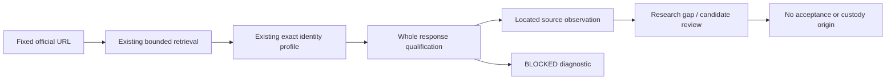

# Official Truth Real Primary Source Bridge 1 — Plan

Issue #908 / Draft #910. Generation 1, Codex Desktop session `01a120e3-dcff-7312-ab6f-dcf6e06e5119`; actual turn metadata: `gpt-6-astra`, `xhigh`. Own worktree on `feat/official-truth-real-primary-source-bridge-1`; immutable TASK blob `a8c51c72c29d523c77786bae2d810a61ff8c9814`, seed `093efa9ba610a856b498899dda826a6c74e29798`, main `2ee48bcd40ba9c056898474a2eab87d0ce0d91ca`. No main synchronization.

## Reconstruction

Live #751 records NORMAL and #899/#906 plus #904/#905 closed. #748 latest MATERIAL receipt is 6036558748; historical #871 metadata hygiene remains open, not a credential-exposure finding. #907/#909 owns Trip Workspace. START_HERE and ACTIVE_WORK_STATUS explicitly defer to live #751; deeper historical CURRENT/HOLD text does not restart old work. TASK/PRECHECK and existing identity, transport, qualification and source-pilot implementation were read. The old real source report remains immutable BLOCKED.

## Implementation sequence

1. Reuse the shipped dormant National List identity profile and source/catalog graph inside a disposable developer adapter. The existing finite importer contracts permit the isolated network seam only in `scripts/official-truth-integrated-pilot-1/official-source.ts`. Add a narrowly fixed National List adapter there; preserve the passport command and historical reports. Do not relax the importer guards or registries.
2. Fresh credentialless government GET through existing server DNS/HTTPS/redirect/media/UTF-8/65,536-byte enforcement. Keep full raw response only in memory. Independently consult official Content API metadata documentation and Home Office authority context.
3. Closed whole-response qualification, including unused fields and opaque publishing metadata. Refuse unknown/changed/unqualified metadata before any observation, digest publication or candidate. No stripped response masquerading as qualified original.
4. Deterministic complete-fragment grammar and exact locator for a narrow National List observation, then a research-only gap evaluator using existing canonical scope/quality helpers. No legal validity inferred from publishing/retrieval timestamps; no accepted Evidence or Rule.
5. Explicit offline synthetic mode and separately opt-in live mode, closed sanitized reports. Independent mutations exercise identity, transport, metadata, scope, temporal and semantic failure paths.
6. Full existing tests including native R3/semantic/storage and #905, typecheck/lint/build/hygiene; exact new remote CI/Auth/Preview after non-force publication. Task-owned contracts/report/self-review/status/handoff and hash manifest.

## Boundaries and risks

No database/schema/API/UI/Trip graph changes. No hosted read/write is needed by this bridge. No new dependencies, services, secrets or paid calls. Production source/extractor registry, Receipt B/K/C/H/Pin, F8 and canonical readers remain frozen. Opaque metadata or upstream drift may block real extraction; a complete engineering implementation must report that result truthfully. Research output carries no person, account, trip, passport number, MRZ or health data. Source observations and synthetic tests are labeled separately.

| Capability | Allowed result |
| --- | --- |
| Exact official identity | Technical verification only |
| Whole-response privacy | Qualified or precise refusal |
| Located text/list membership | Observation only, conditional on whole qualification |
| Complete legal predicate/effective travel period | BLOCKED unless independently proved; never inferred |
| Research packet | Unaccepted review material, no custody origin |
| Acceptance/storage/public runtime | Not authorized; no implementation |

