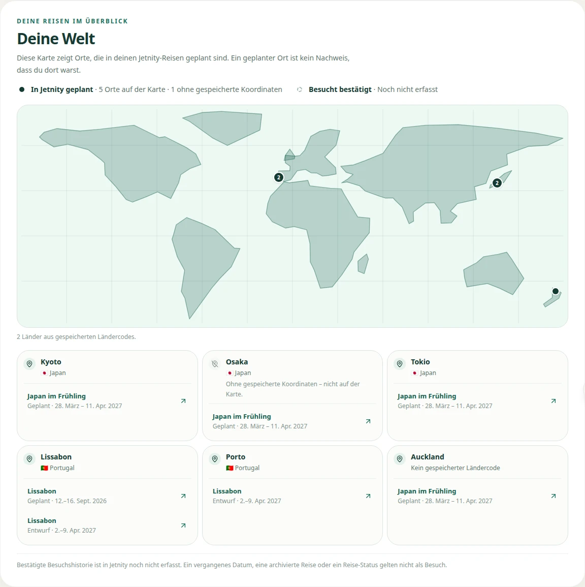
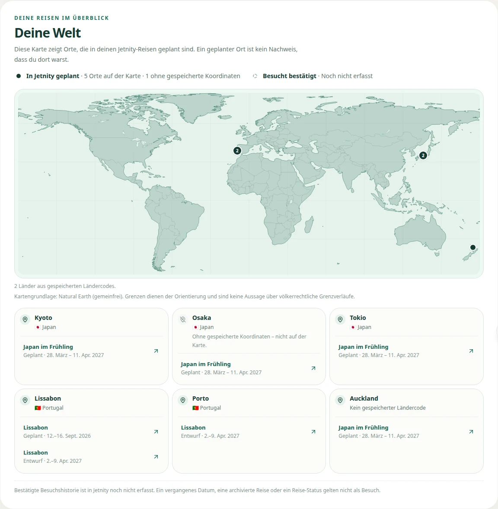
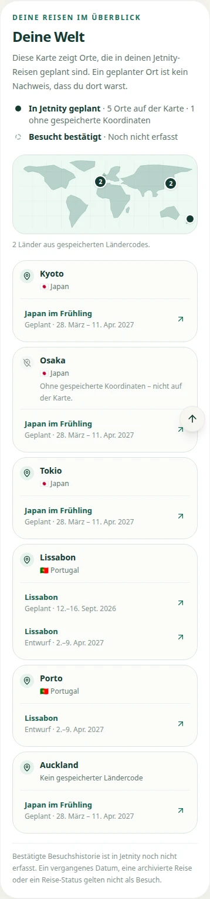
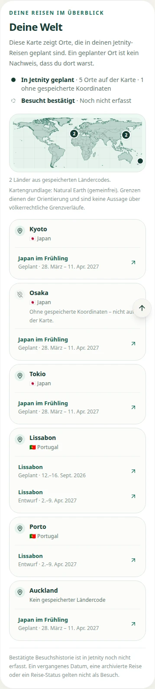
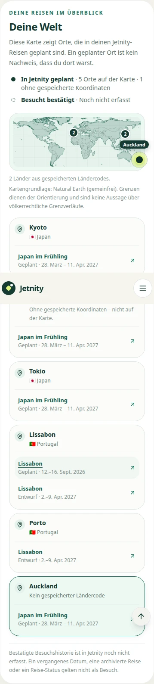
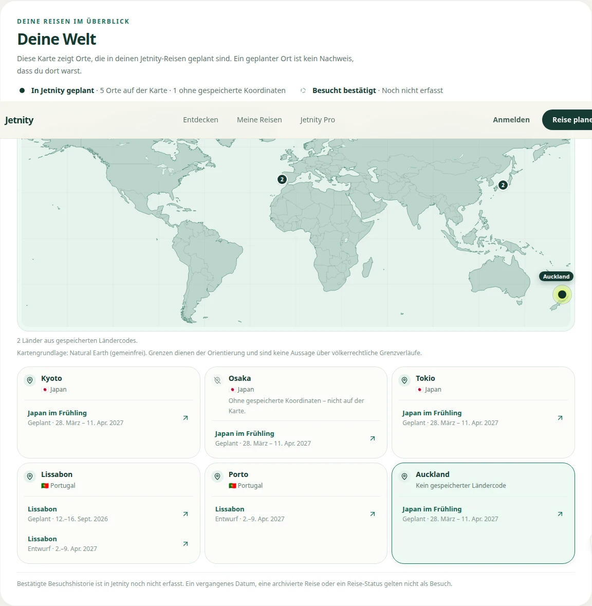
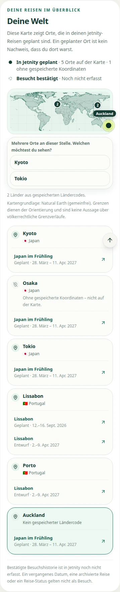
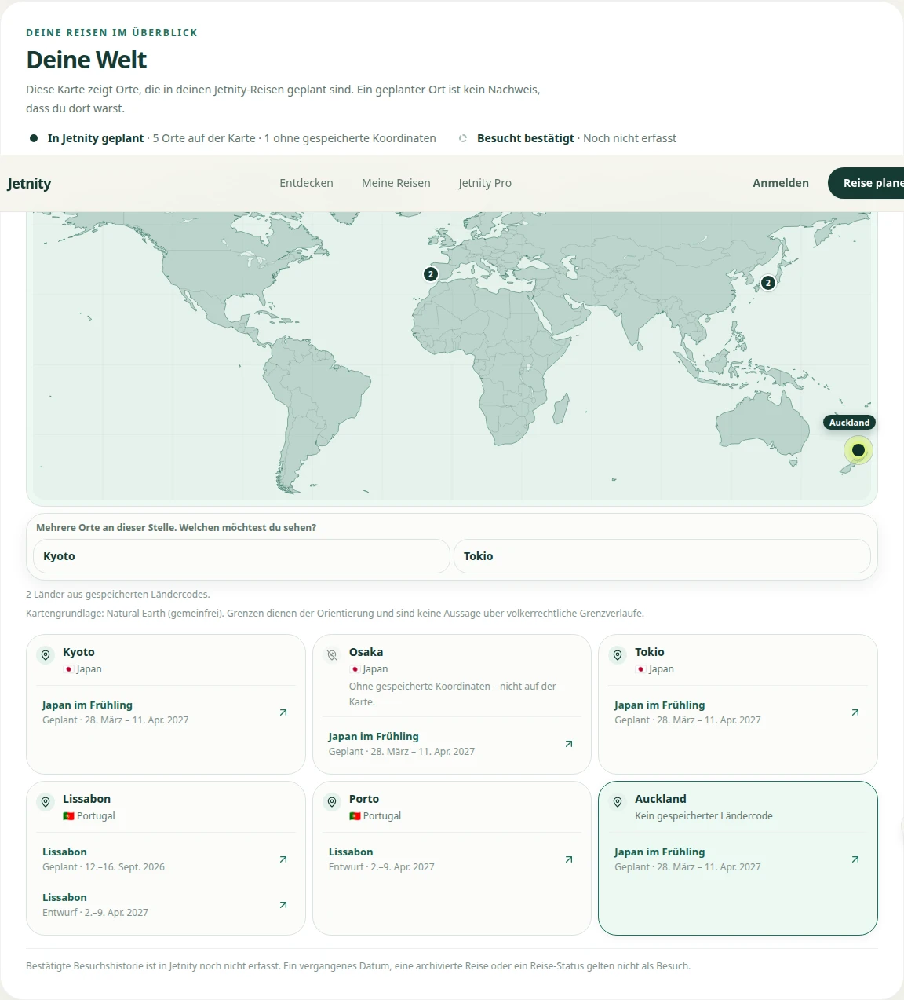
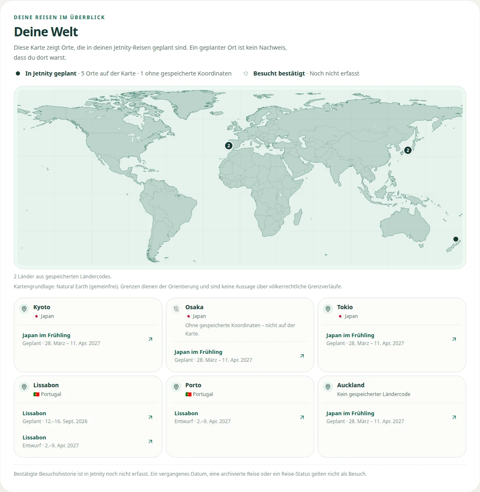

# Realistic World Cartography 1 – Sichtbelege

Stand: 17. September 2026
Draft PR: #443 · Issue: #442
Gegateter Code-Head: `4b6ff53bcbe41978dfab2f11b5911dee99b4b5ef`

Alle Bilder stammen aus dem **Production-Build** (`next start`, nicht Entwicklungsmodus), aufgenommen von `scripts/kartografie/weltkarte-belege.mjs` gegen `/ui-audit/account?zustand=welt`. Die Fixture liegt nur im Audit-Harness.

Reproduzieren:

```
npm run build
node scripts/kartografie/weltkarte-belege.mjs --marke nachher
```

Die Vorher-Bilder entstanden mit demselben Skript in einem `git worktree` auf `main@03842a64698cae1f4f20f54b7e6aa5016982562c`.

---

## Vorher / Nachher, 1280 px

Vorher – handgezeichnete Silhouette, 11 Formen, 192 Stützpunkte:



Nachher – Natural Earth 50m, 278 Landflächen, 14 Binnenseen, 397 Grenzlinien:



## Vorher / Nachher, 390 px





## Ausgewählter Marker

390 px:



1280 px:



Erkennbar bleibt die Auswahl nicht nur an der Farbe: der Punkt wächst, erhält einen Ring in Citrus und eine Beschriftung, und die zugehörige Ortskarte unter der Karte wird hervorgehoben.

## Dichte Marker – zwei Orte an einer Stelle

390 px:



1280 px:



Die Trefferfläche legt die Orte nicht zusammen und entscheidet nicht still, welcher gemeint war. Sie fragt – unter der Karte, damit die Auswahl auf keiner Breite über den Rand läuft und auf dem Telefon nicht die Karte verdeckt, um die es geht.

## Desktop, 1440 px



---

## Gemessen, nicht nur gesehen

Aus `evidence/realistic-world-cartography-1/nachher-bericht.json`:

| Messung | 390 px | 1280 px | 1440 px |
| --- | --- | --- | --- |
| Fremde Netzwerkherkünfte | keine | keine | keine |
| Horizontaler Überlauf | 0 px | 0 px | 0 px |
| Konsolen-/Seitenfehler | keine | keine | keine |
| Kleinste Marker-Trefferfläche | 44 px | 44 px | 44 px |
| `path`-Elemente im Karten-SVG | 3 | 3 | 3 |
| SVG-Knoten gesamt | 22 | 22 | 22 |

SVG-Titel: „Deine Welt“.
SVG-Beschreibung: „Weltkarte mit Küstenlinien, Binnenseen und Landesgrenzen zur Orientierung. 5 Orte auf der Karte · 1 ohne gespeicherte Koordinaten 2 Länder aus gespeicherten Ländercodes.“

Breiten- und zustandsübergreifend zusätzlich: `evidence/REALISTIC_WORLD_CARTOGRAPHY_1_UI_2026-09-17.json` – Account-UI-Audit, WebKit und Chromium, 8 Breiten (280 bis 1280 px) × 3 Zustände, **48/48 grün**.
