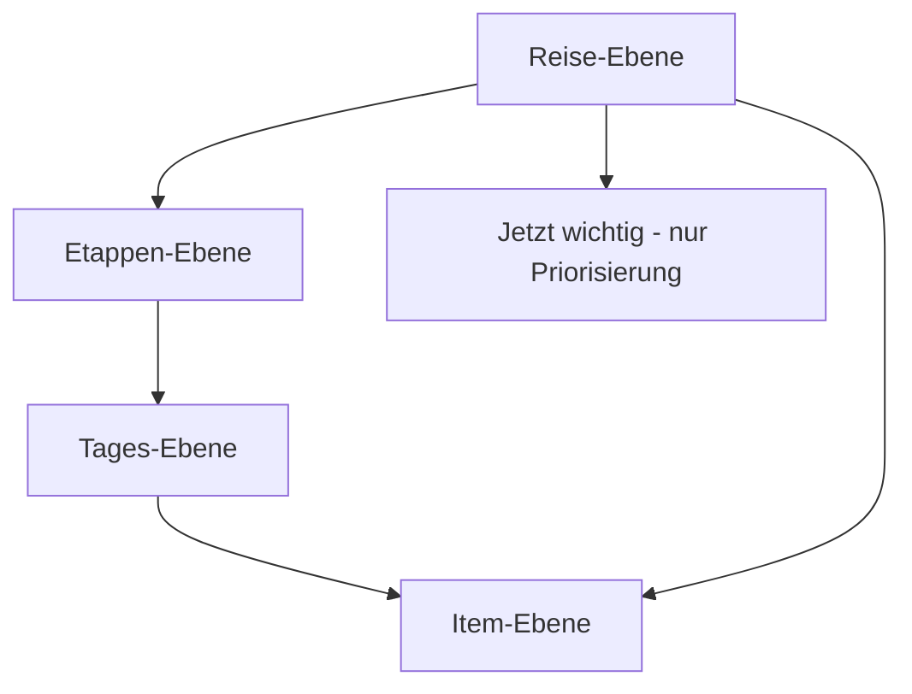

# Jetnity – Trip Workspace Zielarchitektur

Stand: 24. August 2026  
Status: **Vorschlag aus dem Workspace-Audit; nicht Product-Owner-angenommen, nicht implementiert**  
Code-Evidence-Basis (historisch): `docs/TRIP_WORKSPACE_AUDIT.md` gegen `1ec93cc9`  
Aktueller Integrations-`main`: `b7f027ec` (S3/AP-3/Admin C auf `main`; P0-Workspace-Befunde unverändert)

Diese Datei ist die vorgeschlagene Ziel-IA für den **späteren** Implementierungsblock.  
Ein späterer Merge von Draft-PR #55 ist **keine** implizite Product-Owner-Freigabe dieser IA und **keine** Freigabe für TW-1.  
Sie ändert keine Shared Contracts und keine Traveller-/Route-/Provider-Truth.

---

## 1. Produktziel

Der Nutzer öffnet eine Reise und versteht in wenigen Sekunden:

1. Wo bin ich in meiner Reise?
2. Was ist geplant?
3. Was kommt als Nächstes?
4. Was fehlt?
5. Was braucht meine Aufmerksamkeit?
6. Welche Transport-/Unterkunfts-/Buchungsinformationen sind jetzt relevant?
7. Gibt es Einreise-, Transit- oder Safety-Probleme – oder wissen wir es nicht?
8. Was kann ich jetzt tun?

Nichtziel:

> Möglichst viele Jetnity-Funktionen gleichzeitig anzeigen.

Leitsatz:

> Einfach für den Nutzer. Streng logisch im Inneren. Eine Reise, eine Wahrheit.

---

## 2. Regeln

### 2.1 Bereits verbindlich (repo- und domainweit)

Diese Regeln gelten unabhängig von diesem Audit und unabhängig von einem späteren Merge von PR #55:

1. **Unknown bleibt Unknown.** Error ≠ Empty ≠ Stale ≠ Unavailable ≠ `noch_nicht_geprueft` ≠ „alles in Ordnung“.
2. **Keine implizite einzelne Staatsbürgerschaft.** Ein Traveller kann mehrere Citizenships und Dokumente haben.
3. **LLM erklärt, erzeugt aber keine Hard Truth.**
4. **Account ist Zuhause, Workspace ist Kommandozentrale einer Reise.** ADR-0152 bleibt.
5. **Bestehende Foundations nicht neu bauen.** Route, Traveller, Readiness, Safety, Seasonal, Booking-Status bleiben ihre Domänen.

### 2.2 Vorgeschlagene Workspace-IA (nicht Product-Owner-angenommen)

Diese Punkte bleiben Vorschlag/Planung, bis der Product Owner sie ausdrücklich annimmt. Ein Docs-Merge von PR #55 macht sie nicht verbindlich:

1. **Eine Reise, eine Oberfläche.** Flight, Hotel, Activity, Route, Readiness, Safety, Seasonal sind Systeme, keine gleichrangigen Apps.
2. **Komplexität bleibt intern.** Die UI spricht Reise, Etappe, Tag, Punkt, Hinweis, nächster Schritt.
3. **Priorisierung ≠ Wahrheit.** `Jetzt wichtig` sortiert vorhandene Signale. Es speichert keine neuen Fakten.
4. **Mobile und Desktop dieselbe Logik.** Desktop zeigt mehr Fläche, nicht ein zweites Produkt.
5. **Keine Feature-Wunschliste.** Nur Funktionen, die den Reisekern tragen.
6. **Vier Attention-Leerstände** nach §5.4, nicht drei.

---

## 3. Ziel-Informationsarchitektur

### 3.1 Ebenen



#### Reise-Ebene

Gehört hierher:

- Titel, Ziele/Etappen in Nutzersprache, Zeitraum
- Personen aus `party[]`, sonst ehrlich „Anzahl ohne Angaben“
- Ablage: Gerät oder Konto
- grober Reisezustand: Entwurf / in Planung / teilweise gebucht / Reise läuft / abgeschlossen – **nur aus vorhandenen Statusfeldern ableiten**, kein neuer DB-Status in diesem Vorschlag
- eine primäre nächste Aktion
- kritische Aufmerksamkeit (Readiness/Safety/fehlende Pflichtfakten)

Gehört **nicht** hierher:

- vollständige Suchergebnislisten
- alle Aktivitäten aller Tage
- technische Domain-Taxonomie
- Pace-Chips als Identitätskarte

#### Etappen-Ebene

- Ort, An-/Abreise
- Unterkunft dieser Etappe
- relevante Transit-/Flugkanten in/out
- etappenbezogene Safety/Seasonal, falls Evaluation die Etappe trifft

Nicht: Nutzerziel mit Flight-Transit vermischen. Route bleibt traveller-neutral.

#### Tages-Ebene

- geplante Punkte des Tages
- Lücken (freier Vormittag ist leer, nicht fehlerhaft)
- zeitkritische Hinweise nur mit belegter Ortszeit; sonst ohne erfundene UTC-Genauigkeit

#### Item-Ebene

- ein Flug, eine Unterkunft, eine Aktivität, eine Verbindung, ein Mietwagen, eine Notiz
- Booking-Status, manuelle vs nachgewiesene Herkunft
- Preis nur mit Evidence; sonst „kein belegter Preis“

### 3.2 Kompositionsmodell

```text
TripWorkspace
  Kopf          = Reise-Ebene, immer
  Jetzt wichtig = Attention-Layer, immer; darf „nichts Dringendes“ nur als
                  nichts_dringend_geprueft sagen, wenn die relevanten
                  Prüfungen tatsächlich gelaufen sind. Fehlende Evaluation
                  ist noch_nicht_geprueft, nicht unavailable und nicht clean.
  Verlauf       = Etappen + Tage als eine Timeline
  Detail        = gewählte Etappe / Tag / Item / Suche
  Werkzeuge     = Ändern, Punkt hinzufügen, Suche – on demand
```

Mobile:

- eine Spalte
- Kopf kompakt
- `Jetzt wichtig` zuerst
- Verlauf als vertikale Timeline; Tag-Wechsel in der Timeline, nicht als fünfter Domain-Tab
- Detail als Sheet/Unterseite derselben Reise
- eine klare primäre Aktion

Desktop:

- dieselbe Hierarchie
- Master: Kopf + Aufmerksamkeit + Etappen/Tage
- Detail: gewählte Ebene
- Suche/Änderung in einem Panel, nicht alle Domains dauerhaft untereinander

Verboten als Zielzustand:

- Desktop ohne Übersicht
- Mobile-Hauptnavigation „Flüge / Unterkunft / Aktivitäten / Mobilität“ als erste Sprache
- zwei verschiedene Zustandsmaschinen

---

## 4. Source-of-Truth-Modell

```mermaid
flowchart LR
  user[User Input]
  graph[Trip Graph]
  traveller[Traveller Context]
  route[Route Evidence]
  official[Official Evidence]
  safety[Safety Evidence]
  seasonal[Seasonal Evidence]
  commercial[Provider Commercial]
  derived[Derived UI / Attention]
  llm[LLM Explanation]
  ui[Workspace UI]
  user --> graph
  user --> traveller
  graph --> route
  graph --> derived
  traveller --> official
  route --> official
  route --> safety
  route --> seasonal
  official --> derived
  safety --> derived
  seasonal --> derived
  commercial --> derived
  derived --> ui
  llm --> ui
```

Regeln:

| Aussage in der UI | Erlaubte Quelle |
| --- | --- |
| „Hotel für Rom fehlt“ | Trip Graph / Nächte-Abdeckung |
| „Flug Zürich–Rom ausgewählt“ | `trip_items` + Booking-Status |
| „Visum erforderlich“ | nur Official Evidence |
| „Visum unbekannt“ | fehlende Evidence oder fehlender notwendiger Traveller-Fakt |
| „Unruhe in Region X betrifft eure Etappe“ | Safety Evaluation, relevant + frisch |
| „Monsunzeit“ | Seasonal Evaluation, nicht als akute Warnung |
| „Preis 430 CHF“ | Commercial Evidence / Nachweis |
| „Jetnity empfiehlt umzubuchen“ | Derived + Erklärung; Übernahme nur nach Nutzerfreigabe |
| Assistant-Text | niemals die obigen Hard Facts ersetzen |

Assistant-Grenze:

- darf zusammenfassen, was die Truth-Layer bereits wissen
- darf Fragen stellen, die Missing Facts ehrlich machen
- darf **keine** Einreise-, Visa-, Safety-, Preis-, Verfügbarkeits-, Provider- oder Route-Wahrheit erzeugen

---

## 5. „Jetzt wichtig“ – Vertrag

### 5.1 Definition

Eine **abgeleitete, begrenzte Liste** von Aufmerksamkeitspunkten. Kein Speicher, keine Tabelle, kein Provider.

Jeder Eintrag braucht:

- `id` stabil für die Session/Ansicht
- `ebene`: reise | etappe | tag | item | person
- `signal`: Verweis auf eine bestehende Ableitung
- `schwere`: blockierend | bald | hinweis
- `lage`: known_gap | unknown | stale | unavailable | warning  
  `unavailable` nur, wenn Quelle/Provider/Engine tatsächlich unavailable ist.  
  Eine nicht übergebene Evaluation ist kein `unavailable`.
- `aktion`: ein nächster Schritt oder keiner
- **keine** eigenen Faktenfelder

### 5.2 Was ein Punkt werden darf

Nur wenn die zugrunde liegende Domäne das Signal schon ehrlich liefern kann:

- fehlende Unterkunftsnächte, sofern Abdeckung bestimmbar
- unbestimmte oder offene Flugabschnitte, sofern bestimmbar
- Safety `critical_warning` / `important_notice` bei `affected`
- Seasonal `timing_check` bei erheblicher Wirkung
- Readiness `stale` oder offene Checks, die der Nutzer selbst gesetzt/abgeleitet hat
- `insufficient_context` für Official, wenn Citizenship/Document **jetzt** nötig ist
- Provider `unavailable`, wenn der Nutzer eine Suche erwartet **und** die Quelle belegt unavailable ist, nicht nur weil keine Evaluation orchestriert wurde

### 5.3 Was ausdrücklich kein Punkt werden darf

- „Keine Sicherheitswarnungen“, obwohl keine Evaluation übergeben wurde
- „Einreise in Ordnung“, weil Official unknown ist
- Default-Citizenship
- LLM-Priorität
- Marketing- oder Homepage-Inhalte
- jeder Domain-Zähler („0 Aktivitäten“) als gleichgewichtige Pflichtkarte

### 5.4 Leere Aufmerksamkeit

Mindestens **vier** getrennte Leerstände. Das ist der Attention-Truth-State-Vertrag dieses Vorschlags, nicht Runtime und nicht Product-Owner-angenommen:

| Lage | Bedeutung | Darf heute für Safety/Seasonal gelten? |
| --- | --- | --- |
| `nichts_dringend_geprueft` | relevante Evaluation lief erfolgreich, nichts vorrangig | nein, solange keine Evaluation übergeben wurde |
| `noch_nicht_geprueft` | Kontext reicht grundsätzlich; Evaluation wurde noch nicht ausgeführt oder orchestriert | ja: fehlende Prop im Produktpfad |
| `noch_nicht_pruefbar` | notwendiger Graph- oder Traveller-Kontext fehlt | nur bei belegtem fehlendem Kontext |
| `pruefung_nicht_verfuegbar` | Quelle, Provider oder Engine ist tatsächlich unavailable | nur bei belegter Unavailability |

`unknown`, `stale` und `error` bleiben zusätzlich fachlich getrennt.

Diese vier dürfen **nie** in derselben UI-Lage landen.

**Harte Grenze:** Eine fehlende Safety-/Seasonal-Evaluation bzw. fehlende Prop allein darf weder `nichts_dringend_geprueft` / clean noch automatisch `pruefung_nicht_verfuegbar` / unavailable behaupten. Der ehrliche Zustand ist `noch_nicht_geprueft`.

---

## 6. Navigationsmodell

Heute: Domain-Tabs (Mobile) vs. Alles-auf-einmal (Desktop).

Ziel:

| Gerät | Orientierung | Wechsel |
| --- | --- | --- |
| iPhone | Reise → Aufmerksamkeit → nächster Abschnitt der Timeline | Tag/Etappe in der Timeline; Item öffnet Sheet |
| Tablet | wie Mobile, mehr Timeline sichtbar | dasselbe |
| Desktop | Master/Detail | dieselben Ebenen, Detail dauerhaft sichtbar |

Domain-Suche bleibt erreichbar:

- von einem offenen Gap („Unterkunft für Florenz wählen“)
- von einem Item („Flug ersetzen“)
- nicht als gleichrangiger Haupt-Tab der ganzen App

Historischer Tab-Wert `plan` fällt weiter auf die Übersicht. Neue Bereichsnamen dürfen technische Domain-IDs intern behalten, aber nicht als erste Nutzersprache.

URL: mindestens die Reise-ID bleibt kanonisch. Ein späterer, optionaler View-State (`tag`, `etappe`, `item`) darf Deep-Links ermöglichen, darf aber **keine** zweite Wahrheit werden. Fehlt er, gilt die Reise-Ebene.

---

## 7. Traveller- und Citizenship-Naht

Keine neue Truth. Die Ziel-UI muss Foundation E sichtbar machen.

Reise-Ebene:

- Personen aus `party[]`
- fehlt `party` bei `travellers > 0`: „Persönliche Angaben fehlen“ – nicht „Schweizer Reise“
- mehrere Citizenships: nicht auf `[0]` reduzieren
- Official-Ergebnisse je Person; bei mehreren Optionen primär die gültige/günstigere **nach Evidence**, Alternativen progressiv

Workspace darf nicht:

- Wohnsitz, Sprache, Abflugland oder Domain als Citizenship setzen
- Account-Registry vor AP-7 erfinden
- Passnummern, Scans, MRZ, Biometrie, Geburtsdatum verlangen

Citizenship wird erst hart, wenn eine Official-Funktion sie braucht (`docs/TRAVELLER_CITIZENSHIP_REQUIREMENT_POLICY.md`).

---

## 8. Guest- und Account-Verhalten

Unverändert im Ziel:

- dieselbe `Trip`-Form
- Gast: eine aktive Reise, Gerätespeicher, ehrlicher Hinweis
- Konto: DB + RLS, `router.refresh()` nach Write
- Guest→Account auf `/reisen`, verlustfrei für Graph/Party/Readiness
- unbewiesene Flug-Handelsfelder bleiben fail-closed

Workspace-UI muss den Unterschied **erklären**, nicht kaschieren:

- Gast kann planen, aber kommerzielle Flugübernahme ist unavailable
- Hotel-/Aktivitäts-Momentaufnahme ist ein anderes Trust-Niveau als ein Flugnachweis
- das ist keine zweite Produktlogik, nur eine ehrliche Fähigkeitsgrenze

---

## 9. Mapping heutiger Flächen → Ziel

| Heute | Ziel |
| --- | --- |
| Mobile-Tabs Flüge/Unterkunft/Aktivitäten/Mobilität | nicht primär; werden Item-/Gap-Aktionen |
| Übersichtskarten | verdichteter Fortschritt unterhalb von `Jetzt wichtig` |
| Desktop ohne Übersicht | entfällt; Desktop bekommt dieselbe Reise-Ebene |
| Safety-/Seasonal-Karten | keine Dauerflächen; nur Attention oder progressive Details |
| Readiness-Großkarte | Zusammenfassung auf Reise-Ebene, Detail on demand |
| Reiseprofil Pace/Interessen | sekundär unter Wünsche; Chips im Create-Flow später entfernen |
| `TripWorkspacePlan` | Timeline-Körper, dieselbe Graph-Quelle |
| Suchbereiche | Detail/Werkzeug, lazy mount bleibt sinnvoll |
| Account-Übersicht | bleibt Zuhause, kopiert den Workspace nicht |

---

## 10. Vorgeschlagene Entscheidungen – nicht angenommen

Keine ADR-Nummer auf `main`. Parallele Workstreams vergeben gerade eigene ADRs; eine stille `ADR-0159` würde kollidieren.

| Vorschlag | Alternative | Warum empfohlen |
| --- | --- | --- |
| Attention-Layer ohne Persistenz | neue `trip_attention_items`-Tabelle | würde eine zweite Wahrheit erzeugen |
| Timeline statt Domain-Tabs | Domain-Tabs behalten und nur restylen | Tabs zementieren Moduldenken |
| Desktop = dieselbe IA | eigene Desktop-Informationarchitektur | verletzt Geräteparität |
| Safety-Abwesenheit als `noch_nicht_geprueft` | Karte weglassen oder `pruefung_nicht_verfuegbar` annehmen | Stille wirkt wie Entwarnung; fehlende Orchestrierung ist nicht unavailable |
| Create-Flow ohne Pace-Default | `balanced` weiter persistieren | widerspricht geltender PO-Regel |
| Kein Workspace-Assistant als Truth | Assistant darf Visa erklären | verboten durch Logic Standard |

Freigabe der Ziel-IA und von TW-1: nur durch ausdrückliche Product-Owner-Entscheidung **nach** Review. Ein Merge von PR #55 ist dafür **kein** Ersatz.

---

## 11. Bewusste Nicht-Ziele

- Homepage-Neupositionierung
- Live-Provider, Secrets, Kosten
- Traveller-Registry / Account-weite Profile
- Finance / Payment
- Collaboration (Draft-PR #28 liegt außerhalb dieses `main`)
- universeller Mega-Datentyp über alle Travel-Domains
- Weltkarte, Social, Content-Plattform
