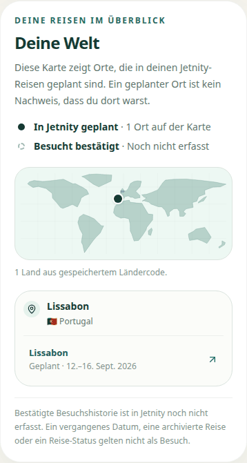
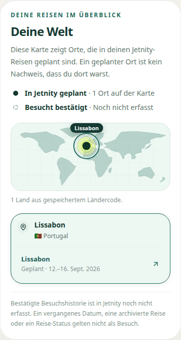
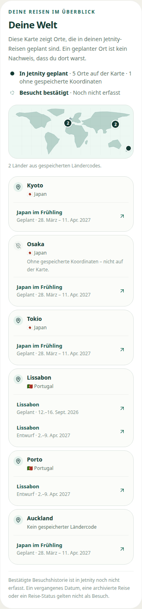
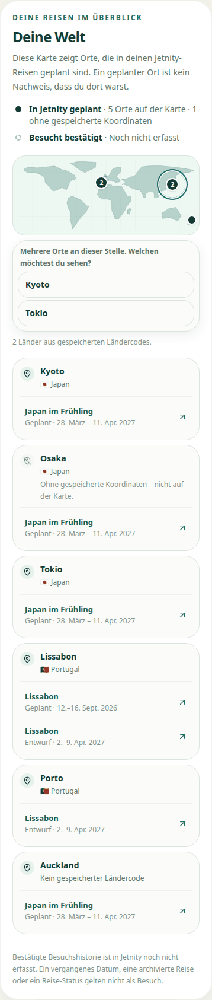
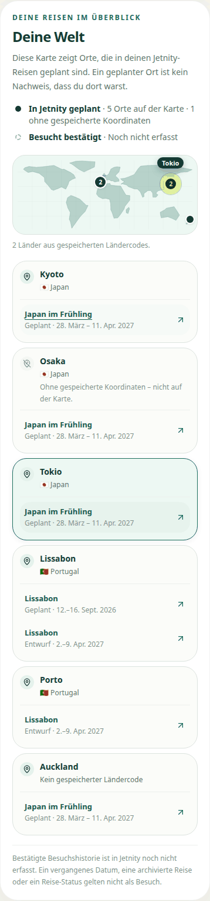
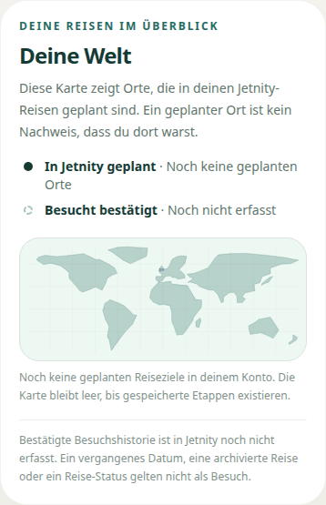
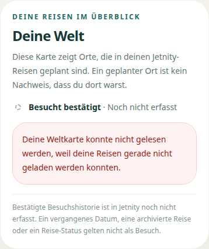
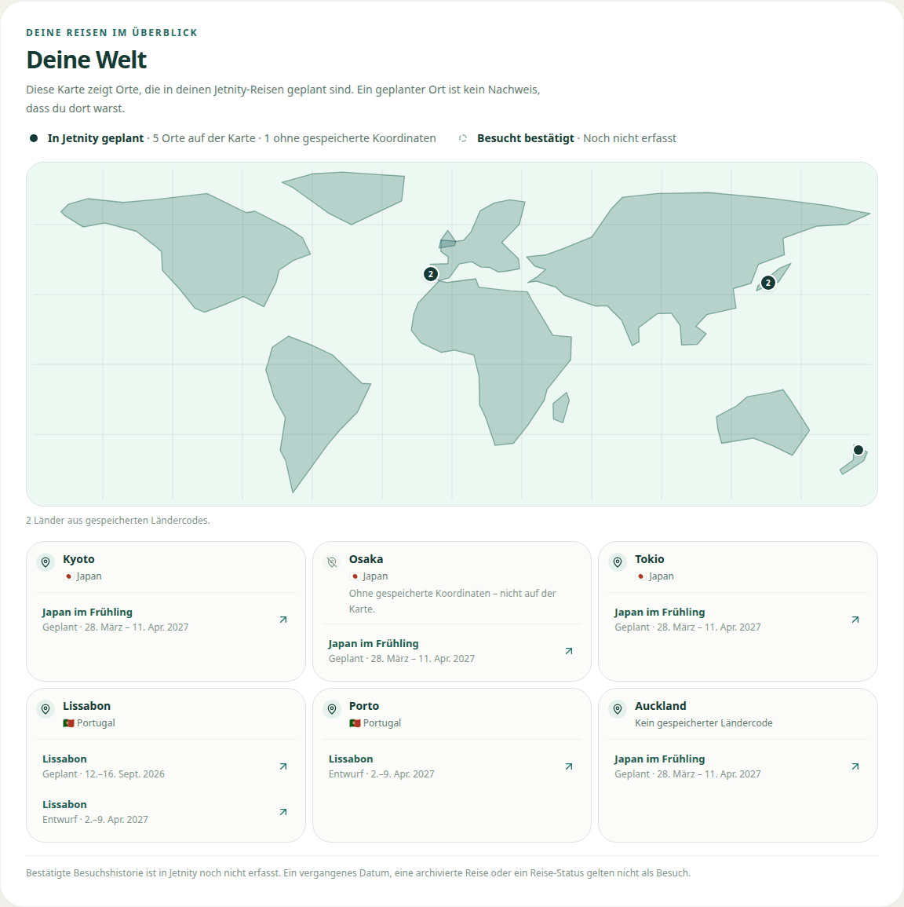
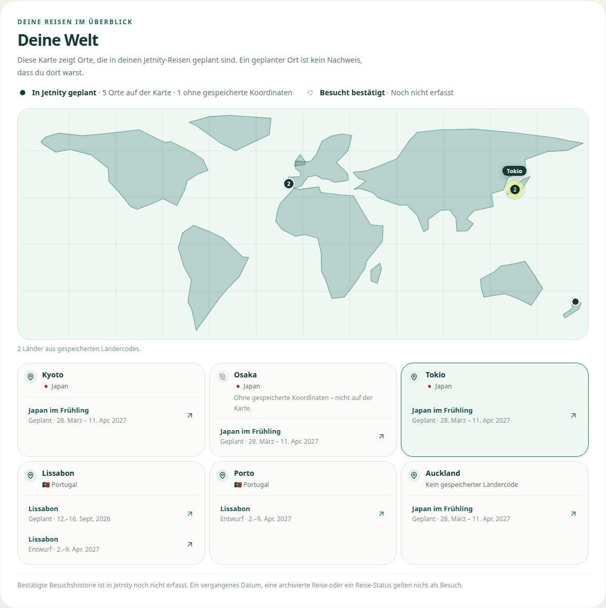

# World Map Polish 2 – Visuelle Exact-Head-Evidenz

Stand: 17. September 2026  
Issue: #436 · Draft PR: #437 · Branch: `feat/phase-1-world-map-polish-2`

Gegateter Code-Head: `f5052963774c8cf6dfb6b0893690fadbef6f44db`  
Nach diesem Commit ändert kein Commit dieses Branch eine Datei unter `components/`, `lib/`, `app/`, `scripts/`, `supabase/` oder `types/`. Prüfbar mit:

```
git diff --stat f5052963774c8cf6dfb6b0893690fadbef6f44db HEAD -- components lib app scripts supabase types
```

Diese Ausgabe muss leer sein. Ist sie es nicht, ist die Evidenz hier ungültig und braucht ein neues Gating.

---

## Wie aufgenommen

| | |
| --- | --- |
| Server | `npm run build` gefolgt von `next start -p 3470` – **Production-Build**, kein `next dev` |
| Umgebung | `JETNITY_UI_AUDIT=1`, `VERCEL_ENV=preview`, Supabase-Platzhalter |
| Pfad | `/ui-audit/account?zustand=welt\|reise\|leer\|fehler` |
| Browser | Chromium und WebKit, Chromium zusätzlich mit `prefers-reduced-motion: reduce` |
| Breiten | 280, 320, 360, 390, 430, 768, 844×390, 1280, 1536 |
| Bilder | Sektion `[data-world-map="ein"]`, ohne DOM- oder CSS-Eingriff |
| Maschinenlesbar | `docs/evidence/WORLD_MAP_POLISH_2_UI_2026-09-17.json` |

Für die Bilder wird das Fenster so hoch gemacht, dass die Sektion vollständig hineinpasst. Grund: ein Element-Screenshot scrollt die Sektion unter die klebende Kopfzeile, die dann über der Karte liegen würde. Breite, Layout und Zustand bleiben unverändert; gemessen wird immer im echten Viewport der jeweiligen Referenzbreite.

Fixtures liegen ausschliesslich im Harness (`components/account/AccountAuditClient.tsx`), nie im Produktspeicher. Der Zustand `welt` enthält absichtlich: zwei gleich betitelte eigene Reisen auf derselben `placeId`, dicht liegende Japan-Etappen, eine Etappe ohne Koordinaten, eine ohne Ländercode und einen Marker am rechten Kartenrand.

---

## 390 px – iPhone-artige Breite

### Eine Reise, ruhender Zustand

`docs/evidence/world-map-polish-2/390-reise.png`



Kein grauer Balken unter der Karte mehr, zwei Statuskarten sind zu einer zweizeiligen Legende geworden, die Ortskarte nennt Land, Reisetitel, Status und Zeitraum.

### Eine Reise, Marker ausgewählt

`docs/evidence/world-map-polish-2/390-reise-ausgewaehlt.png`



### Mehrere Reisen, ruhender Zustand

`docs/evidence/world-map-polish-2/390-welt.png`



Sichtbar: zwei Zähler-Marker für dicht liegende Orte, `Osaka` mit `Ohne gespeicherte Koordinaten – nicht auf der Karte.`, `Auckland` mit `Kein gespeicherter Ländercode`, und zwei gleich betitelte `Lissabon`-Reisen, die sich über Status und Zeitraum unterscheiden.

### Dichte Orte, Auswahl offen, mit Tastaturfokus

`docs/evidence/world-map-polish-2/390-welt-auswahl-offen.png`



Der Fokusring liegt auf dem Zähler-Marker; die Auswahl wurde mit `Enter` geöffnet. Sie steht **unter** der Karte, nicht als Blase darauf – eine am Punkt verankerte Blase lief bei 390 px messbar über den Rand (`scrollWidth 417 > 390`).

### Nach der Auswahl

`docs/evidence/world-map-polish-2/390-welt-ausgewaehlt.png`



### Leerer Zustand

`docs/evidence/world-map-polish-2/390-leer.png`



Die Legende sagt `Noch keine geplanten Orte`, der vollständige Satz steht einmal unter der Karte – nicht doppelt.

### Lesefehler

`docs/evidence/world-map-polish-2/390-fehler.png`



`Besucht bestätigt · Noch nicht erfasst` bleibt sichtbar. Nur die geplante Hälfte entfällt, weil dazu keine Aussage möglich ist.

---

## 1280 px – Desktop

| Bild | Datei |
| --- | --- |
| Eine Reise | `docs/evidence/world-map-polish-2/1280-reise.png` |
| Eine Reise, ausgewählt | `docs/evidence/world-map-polish-2/1280-reise-ausgewaehlt.png` |
| Mehrere Reisen | `docs/evidence/world-map-polish-2/1280-welt.png` |
| Dichte Orte, Auswahl offen | `docs/evidence/world-map-polish-2/1280-welt-auswahl-offen.png` |
| Nach der Auswahl | `docs/evidence/world-map-polish-2/1280-welt-ausgewaehlt.png` |
| Leerer Zustand | `docs/evidence/world-map-polish-2/1280-leer.png` |
| Lesefehler | `docs/evidence/world-map-polish-2/1280-fehler.png` |





Die Karte nutzt die volle Kartenbreite, die Ortskarten stehen darunter in drei Spalten.

---

## Gemessene Werte

108 Kombinationen, **108 grün**.

| Prüfung | Ergebnis über alle 108 Kombinationen |
| --- | --- |
| horizontaler Overflow der Seite, ruhend | 0 |
| horizontaler Overflow bei offener Marker-Auswahl | 0 |
| Sektion breiter als ihr Kasten | 0 |
| Trefferflächen unter 44 px in der Sektion | 0 |
| Marker ausserhalb der Kartenfläche | 0 |
| Landpfade über die ganze Projektionsbreite (entfernter Polplatzhalter) | 0 |
| `0 besucht` / `undefined` / `NaN` im sichtbaren Text | 0 |
| `Besucht bestätigt` sichtbar | 108 von 108 |
| `data-world-map-visited` | `nicht_erfasst` in allen 108 |
| `data-world-map-search` | `nein` in allen 108 |
| Konsolen- und Seitenfehler | **0** |
| echte Anfragefehler | **0** |
| Anfragen an fremde Hosts | **0** |

### Gerenderte Kartenfläche

`viewBox` ist in jeder Breite `0 6 360 142`, 35 Landpfade, 15 Gitterlinien.

| Breite | Kartenfläche |
| --- | --- |
| 280 | 188 × 74 |
| 320 | 228 × 90 |
| 360 | 268 × 106 |
| 390 | **298 × 118** |
| 430 | 338 × 133 |
| 768 | 636 × 251 |
| 844 × 390 | 712 × 281 |
| 1280 | **1068 × 421** |
| 1536 | 1068 × 421 |

### Abgebrochene RSC-Vorabrufe – benannt, nicht als Fehler gewertet

730 Einträge, alle `net::ERR_ABORTED` auf `next/link`-Vorabrufe mit `_rsc=`. Ziele sind `/reisen`, `/login?next=/account…`, `/planen` und die Reiselinks. Ursache: der Harness hat keine Sitzung, die Ziele leiten auf `/login` um, Next bricht den Vorabruf ab.

Kein Laufzeitfehler dieser Oberfläche, und kein Regress dieses Slice: dieselben Abbrüche treten in den Zuständen `leer` und `fehler` auf, in denen die Weltkarte **keinen einzigen** Reiselink rendert (dort mit den Zielen `/reisen`, `/login`, `/planen`). Sie stammen aus der Account-Navigation und der Leerzustands-Aktion.

### Reduzierte Bewegung

Der Lauf `chromium / prefers-reduced-motion: reduce` ist in allen 36 Kombinationen grün. `scrollIntoView` benutzt dann `behavior: 'auto'` statt `'smooth'`.

### Ausgewählter Marker – nicht nur Farbe

Gemessen bei 1280 px, Zustand `welt`:

| | ausgewählt | nicht ausgewählt |
| --- | --- | --- |
| Hof | 36 × 36 px, `rgba(223, 244, 122, 0.55)` | 24 × 24 px, `rgba(21, 58, 51, 0)` |
| Kern | 18 × 18 px, `rgb(15, 48, 42)`, Ring/Schatten | 18 × 18 px, `rgb(21, 58, 51)`, Ring/Schatten |
| `aria-current` | `true` | nicht gesetzt |
| Namensschild | sichtbar | nicht vorhanden |

Grösse, Ring, `aria-current` und Namensschild unterscheiden den Zustand zusätzlich zur Farbe.

### Gleich betitelte Reisen bleiben unterscheidbar

Reiselinks im Zustand `welt` bei 390 px, gelesen aus dem DOM:

| Sichtbarer Titel | Sichtbares Meta | `href` | `aria-label` enthält `tripId` |
| --- | --- | --- | --- |
| Lissabon | Geplant · 12.–16. Sept. 2026 | `/reisen/11111111-1111-4111-8111-111111111111` | ja |
| Lissabon | Entwurf · 2.–9. Apr. 2027 | `/reisen/33333333-3333-4333-8333-333333333333` | ja |

Zwei gleich betitelte eigene Reisen auf derselben `placeId` führen zu zwei Aktionen mit **verschiedenen** Zielen und verschiedenen zugänglichen Namen. Nichts wird über den Titel zusammengelegt.

---

## Nächster Schritt

Technical-Lead-Exact-Head-Re-Review von Draft PR #437.  
**Nicht Ready setzen. Nicht mergen. Keinen Folge-Slice starten.**
